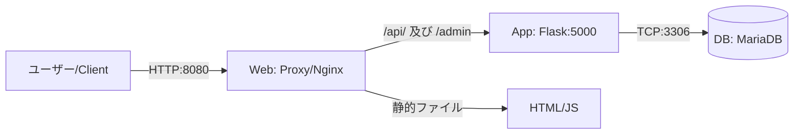

# 【Ubuntu 24.04】Docker Composeで構築する自作ユーザー行動監視サーバー（愛称：グッバイ Google Analytics(^_^）/

## 1. 課題概要

### 目的
本プロジェクト「Simple-tracker」は、Google Analytics等のサードパーティ製ツールに依存せず、プライバシーに配慮した形でWebサイト上のユーザー行動を記録・可視化するサーバーを構築することを目的とする。既存の解析ツールは多機能だが、データが外部に送信される懸念がある。本システムは自社または自分管理下のサーバーで完結し、Docker Composeを用いることで、手順書通りに作業すれば誰でも再現可能な環境構築を目指す。

### 完成条件
1. Ubuntu 24.04上で、コマンド一つでWeb・App・DBのサーバー群が一括起動すること。
2. ブラウザから管理画面の `/admin` にアクセスし、ログが閲覧できること。
3. 外部サイトやテスト用ページのJavaScriptから、非同期通信でログを送信し、DBに保存されること。

### 採用した発展要素
本構築では、授業内容を基盤として課題要件の以下の発展的要素を取り入れている。
* **例 B：Docker Compose による Web＋DB の 2 コンテナ構成**
  実際には Nginx、Flask (Gunicorn)、MariaDB の3層アーキテクチャを採用している。
* **例 Aの一部：逆プロキシであるNginxによるCORS制御**
  外部ドメインからのビーコン送信を受け付けるためのオリジン許可設定を実装している。

---

## 2. 前提条件

構築作業を行う環境および前提は以下の通りである。

* **対象OS:** Ubuntu 24.04 LTS
* **実行環境:** VMwareなどのローカル仮想マシン、または学内クラウドVM
* **利用ツール:** OSパッケージ管理のapt、git、docker、docker compose
* **ネットワーク条件:** * インターネット接続あり。パッケージおよびDockerイメージ取得のため。
  * 固定IPまたはローカルIPでのアクセスが可能であり、HTTPのTCP 8080番ポートが開放されていること。
* **操作権限:** sudo権限を持つ一般ユーザー。本手順書ではユーザー名を ubuntu と想定する。

---

## 3. システム構成図とポート設計

### ポート設計と通信経路
外部からのアクセスはフロントエンドのNginx（Proxy）がすべて受け付け、リクエストパスに応じて内部のコンテナへ処理を振り分ける。データベースは内部ネットワークに完全に隔離する。

* **外部からProxy (Nginx) へ:** TCP 8080 のHTTPで受付。静的ファイルを配信する。
* **ProxyからApp (Flask) へ:** リクエストパスが `/api/` または `/admin` の場合、Docker内部ネットワーク経由でAppコンテナのTCP 5000へリバースプロキシする。
* **AppからDB (MariaDB) へ:** ログの保存・取得のため、Docker内部ネットワーク経由でDBコンテナのTCP 3306へ通信する。

### 全体構成図


### ディレクトリ構成

GitHubリポジトリよりクローンする構成は以下の通りである。

```text
good_bye_google_analytics/
├── README.md                
└── simple-tracker/
    ├── docker-compose.yml   
    ├── backend/
    │   ├── app.py           
    │   ├── Dockerfile       
    │   └── requirements.txt 
    ├── nginx/
    │   └── default.conf     
    └── html/
        ├── tracker.js       
        └── test.html        

```

---

## 4. 事前準備

Ubuntu環境を最新化し、DockerおよびDocker Composeを導入する。

### 4.1 パッケージの更新

```bash
# パッケージリストを更新し、インストール済みパッケージをアップグレードする
sudo apt update && sudo apt upgrade -y

```

### 4.2 DockerとDocker Composeのインストール

```bash
# HTTPS経由でリポジトリを使用するための必須パッケージをインストール
sudo apt install -y ca-certificates curl gnupg lsb-release

# Docker公式のGPG鍵を保存するディレクトリを作成
sudo mkdir -p /etc/apt/keyrings

# Docker公式のGPG鍵をダウンロードして配置
curl -fsSL [https://download.docker.com/linux/ubuntu/gpg](https://download.docker.com/linux/ubuntu/gpg) | sudo gpg --dearmor -o /etc/apt/keyrings/docker.gpg

# Dockerの公式リポジトリをAPTソースリストに追加
echo "deb [arch=$(dpkg --print-architecture) signed-by=/etc/apt/keyrings/docker.gpg] [https://download.docker.com/linux/ubuntu](https://download.docker.com/linux/ubuntu) $(lsb_release -cs) stable" | sudo tee /etc/apt/sources.list.d/docker.list > /dev/null

# 追加したリポジトリのパッケージリストを更新し、Docker本体とプラグインをインストール
sudo apt update
sudo apt install -y docker-ce docker-ce-cli containerd.io docker-compose-plugin

```

### 4.3 インストール完了の確認

以下のコマンドを実行し、バージョン情報が出力されることを確認する。

```bash
docker --version
docker compose version

```


---

## 5. 構築手順

GitリポジトリおよびDocker Composeを利用することで、構築の再現性を高めている。

### 手順1: リポジトリのクローン

ソースコード一式をダウンロードし、作業ディレクトリへ移動する。

```bash
# ホームディレクトリへ移動
cd ~
# GitHubからリポジトリをクローン
git clone [https://github.com/hou-rai3/good_bye_google_analytics.git](https://github.com/hou-rai3/good_bye_google_analytics.git)
# 作業用ディレクトリへ移動
cd good_bye_google_analytics/simple-tracker

```

### 手順2: コンテナのビルドと起動

Docker Composeを使用して、設定ファイルに基づきイメージのビルドとコンテナの起動を行う。

```bash
# バックグラウンドでイメージをビルドし、全コンテナを起動する
sudo docker compose up -d --build

```

---

## 6. 設定ファイル解説

設定ファイルの完全版を記載する。本構成ではシークレット情報はダミー値に置き換えて記載している。

### 6.1 docker-compose.yml

各コンテナの依存関係とネットワーク定義。

* **保存パス:** `~/good_bye_google_analytics/simple-tracker/docker-compose.yml`
* **所有権と権限:** ubuntuユーザー、644

```yaml
version: '3.8'

services:
  db:
    image: mariadb:10.6
    restart: always
    environment:
      MYSQL_ROOT_PASSWORD: root_password_here
      MYSQL_DATABASE: tracker_db
      MYSQL_USER: tracker_user
      MYSQL_PASSWORD: user_password_here
    volumes:
      - db_data:/var/lib/mysql
    networks:
      - tracker-net

  app:
    build: ./backend
    restart: always
    environment:
      DB_HOST: db
      DB_USER: tracker_user
      DB_PASSWORD: user_password_here
      DB_NAME: tracker_db
    depends_on:
      - db
    networks:
      - tracker-net

  proxy:
    image: nginx:alpine
    restart: always
    ports:
      - "8080:80"
    volumes:
      - ./nginx/default.conf:/etc/nginx/conf.d/default.conf:ro
      - ./html:/usr/share/nginx/html:ro
    depends_on:
      - app
    networks:
      - tracker-net

volumes:
  db_data:

networks:
  tracker-net:
    driver: bridge

```

### 6.2 Nginx 設定ファイル

リバースプロキシとCORSの制御設定。アップストリームの向き先を `app` サービスに指定している。

* **保存パス:** `~/good_bye_google_analytics/simple-tracker/nginx/default.conf`
* **所有権と権限:** ubuntuユーザー、644

```nginx
server {
    listen 80;
    server_name localhost;

    # 静的ファイルの配信
    location / {
        root /usr/share/nginx/html;
        index test.html;
    }

    # APIへのリバースプロキシ
    location /api/ {
        # CORS設定：異なるドメインからのJSリクエストを許可
        add_header 'Access-Control-Allow-Origin' '*';
        add_header 'Access-Control-Allow-Methods' 'GET, POST, OPTIONS';
        add_header 'Access-Control-Allow-Headers' 'Content-Type';

        proxy_pass http://app:5000;
        proxy_set_header Host $host;
        proxy_set_header X-Real-IP $remote_addr;
    }

    # 管理画面へのリバースプロキシ
    location /admin {
        proxy_pass http://app:5000/admin;
        proxy_set_header Host $host;
        proxy_set_header X-Real-IP $remote_addr;
    }
}

```

---

## 7. 動作確認と検証

構築したシステムが正常に動作しているか、多角的に検証する。

### 7.1 コンテナの稼働ステータス確認

全てのコンテナがUp状態であること、およびProxyコンテナの8080番ポートが開放されているか確認する。

```bash
sudo docker compose ps

```


### 7.2 コマンドラインからのAPI疎通確認

Proxy（8080ポート）を経由してAppのAPIへ正しくルーティングされ、DBへの書き込み処理が走るかテストする。

```bash
curl -X POST -H "Content-Type: application/json" -d '{"action": "curl_test_event"}' http://localhost:8080/api/track

```


### 7.3 バックエンドログの確認

Appコンテナがエラーなく起動していることを確認する

```bash
sudo docker compose logs app

```


### 7.4 ブラウザからの動作確認とログ閲覧

1. ブラウザで `http://localhost:8080/test.html` にアクセスする。
2. 画面上のボタンをクリックし、「ログを送信しました」のアラートが出ることを確認する。
3. ブラウザで `http://localhost:8080/admin` にアクセスする。
4. 先ほどのテストイベントやボタンクリックの履歴がテーブル形式で表示されていれば成功である。


---

## 8. トラブルシューティング

* **事象1: ポート8080が既に使用されている**
* **エラー:** `Bind for 0.0.0.0:8080 failed: port is already allocated`
* **原因:** 他のアプリケーションが既に8080番ポートを占有している。
* **対処:** `docker-compose.yml` のProxyポート設定を `"8081:80"` 等の空いているポートに変更する。


* **事象2: Appがデータベースに接続できない**
* **エラー:** Appコンテナのログに `Can't connect to MySQL server` と出る。
* **原因:** DBコンテナの初期化が完了する前にAppコンテナが接続しようとした。
* **対処:** 本構成では `restart: always` を設定しているため自動で再試行され復旧する。手動で即時解決する場合は `sudo docker compose restart app` を実行する。


---

## 9. セキュリティとまとめ

* **最小権限の原則:** DB接続にはrootユーザーではなく、専用の一般ユーザーを使用している。
* **ネットワークの閉域化:** DBやAppのポートはホストへ直接公開せず、Dockerの内部ネットワークでのみ通信させ、外部からの直接攻撃を防いでいる。
* **秘密情報の扱い:** 本手順書上ではダミー値を記載している。

### 今後の展望

ProxyコンテナにSSL証明書を追加してHTTPS化を行うことで、よりセキュアな通信網の構築が可能である。

---

## 10. 参考資料・特記事項

* Docker Compose 公式ドキュメント: https://docs.docker.com/compose/
* Flask 公式ドキュメント: https://flask.palletsprojects.com/
* Nginx リバースプロキシ設定: https://docs.nginx.com/nginx/admin-guide/web-server/reverse-proxy/

**生成AIの利用について**
本ドキュメントの作成および手順の構成推敲にあたり、LLMを活用した。出力されたコマンド、設定ファイルの内容、および検証手順はすべてローカル環境にて動作検証を実施し、事実関係と課題要件との整合性を確認した上で提出している。

```
