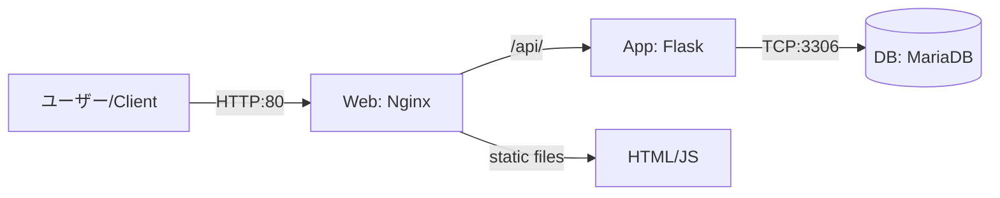

# 【Ubuntu 24.04】Docker Composeで構築する自作ユーザー行動監視サーバー（愛称 〜グッバイ Google Analytics (^_^)/ 〜）

## 1. 課題概要

### 目的

本プロジェクト「Simple-Click-Visualizer」は、Google Analytics等のサードパーティ製ツールに依存せず、プライバシーに配慮した形でWebサイト上のユーザー行動（クリックイベント等）を記録・可視化するサーバーを構築することを目的とする。
既存の解析ツールは多機能だが、データが外部に送信される懸念がある。本システムは**自社（自分）管理下のサーバーで完結**し、Docker Composeを用いることで、手順書通りに作業すれば誰でも再現可能な環境構築を目指す。

### 完成条件

1. Ubuntu 24.04上で、コマンド一つでWeb・AP・DBサーバー群が一括起動すること。
2. ブラウザから管理画面（`/admin`）にアクセスし、ログが閲覧できること。
3. 外部サイト（またはテスト用ページ）のJavaScriptから、非同期通信でログを送信し、DBに保存されること。

### 採用した発展要素

本構築では、課題要件の以下の発展的要素を取り入れている。

* **例 B：Docker Compose による Web＋DB の 2 コンテナ構成**
* 実際には **Nginx (Web)**、**Flask (App)**、**MariaDB (DB)** の3層アーキテクチャを採用。


* **例 A：逆プロキシ（Nginx）によるCORS制御**
* 外部ドメインからのビーコン（ログ送信）を受け付けるためのオリジン許可設定を実装。


---

## 2. 前提条件

構築作業を行う環境および前提は以下の通りである。

* **対象OS:** Ubuntu 24.04 LTS (Noble Numbat)
* **実行環境:** ローカル物理マシン または 仮想マシン
* **権限:** `sudo` 権限を持つユーザーであること
* **ネットワーク:** インターネット接続（Dockerイメージ取得のため）、HTTP(80番ポート)が開放されていること
* **前提知識:** Linuxの基本コマンド操作、基本的なTCP/IPの理解

---

## 3. システム構成図とディレクトリ設計

### 全体構成

Nginxをフロントに置き、静的ファイル配信とAPIへのリバースプロキシを行う。データはMariaDBに永続化する。



### ディレクトリ構成

GitHubリポジトリよりクローンする構成は以下の通りである。

```text
~/simple-tracker/
├── docker-compose.yml       # コンテナ構成定義（完全版）
├── .env                     # 環境変数（パスワード等を管理）
├── backend/
│   ├── app.py               # Flaskアプリケーション本体
│   ├── Dockerfile           # Python環境定義
│   └── requirements.txt     # Python依存ライブラリ
├── nginx/
│   └── default.conf         # Nginx設定（リバースプロキシ・CORS）
└── html/
    ├── tracker.js           # ログ送信クライアントスクリプト
    └── test.html            # 動作確認用ページ

```

---

## 4. 事前準備

Ubuntu環境を最新化し、DockerおよびDocker Composeを導入する。

### 4.1 パッケージの更新

まずシステムを最新の状態にする。

```bash
sudo apt update && sudo apt upgrade -y

```

### 4.2 Docker / Docker Compose のインストール

Ubuntu公式リポジトリ、またはDocker公式の手順に従う。ここではaptを用いた標準的な手順を示す。

```bash
# 必要なパッケージのインストール
sudo apt install -y ca-certificates curl gnupg lsb-release

# Docker公式GPG鍵の追加
sudo mkdir -p /etc/apt/keyrings
curl -fsSL https://download.docker.com/linux/ubuntu/gpg | sudo gpg --dearmor -o /etc/apt/keyrings/docker.gpg

# リポジトリのセットアップ
echo \
  "deb [arch=$(dpkg --print-architecture) signed-by=/etc/apt/keyrings/docker.gpg] https://download.docker.com/linux/ubuntu \
  $(lsb_release -cs) stable" | sudo tee /etc/apt/sources.list.d/docker.list > /dev/null

# Docker Engineのインストール
sudo apt update
sudo apt install -y docker-ce docker-ce-cli containerd.io docker-compose-plugin

```

### 4.3 動作確認

以下のコマンドでバージョンが表示されれば準備完了である。

```bash
docker compose version
# 出力例: Docker Compose version v2.xx.x

```

---

## 5. 構築手順（再現手順）

本システムはGitリポジトリおよびDocker Composeを利用することで、複雑な手順を省略し、再現性を高めている。

### 手順1: リポジトリのクローン

ソースコード一式をローカル環境にダウンロードする。

```bash
cd ~
git clone https://github.com/oka-bacon/simple-tracker.git
cd simple-tracker

```

### 手順2: 環境変数の設定（セキュリティ配慮）

DBのパスワードなどの機密情報は、直接コードに書かず `.env` ファイルで管理する。
サンプルファイルをコピーし、必要に応じて編集する。

```bash
# サンプルから本番用設定を作成
cp .env.example .env

# 内容を確認（任意でパスワードを変更可能）
cat .env

```

**.env の内容（例）**

```ini
MYSQL_ROOT_PASSWORD=my-secret-pw
MYSQL_DATABASE=tracker_db
MYSQL_USER=tracker_user
MYSQL_PASSWORD=tracker_user_pw

```

### 手順3: コンテナのビルドと起動

Docker Composeを使用して、イメージのビルドとコンテナの起動を行う。

```bash
# バックグラウンド(-d)でビルド(--build)して起動
sudo docker compose up -d --build

```

### 手順4: 起動状態の確認

全てのコンテナが `Up` 状態であることを確認する。

```bash
sudo docker compose ps

```

実行結果例：

```text
NAME                     STATUS          PORTS
simple-tracker-db-1      Up (healthy)    3306/tcp
simple-tracker-backend-1 Up              5000/tcp
simple-tracker-nginx-1   Up              0.0.0.0:80->80/tcp

```

---

## 6. 動作確認と検証

サーバーが正常に機能しているか、以下の手順で検証を行う。

### 検証1: テストページへのアクセス

ブラウザを開き、以下のURLへアクセスする。

* URL: `http://localhost/test.html` (またはサーバーのIPアドレス)

画面上のボタンをクリックし、「Action Logged!」などの表示が出れば、JavaScriptからサーバーへの通信が成功している。

*(ここに `test.html` のブラウザスクリーンショットを貼る)*

### 検証2: ログデータの確認（管理画面）

ログがデータベースに保存されているか確認する。

* URL: `http://localhost/admin`

クリックした日時、User-Agent等の情報がテーブル形式で表示されていれば、Web→App→DBの連携は正常である。

*(ここに `/admin` 画面のスクリーンショットを貼る)*

### 検証3: DBコンテナの永続化確認

一度コンテナを削除してもデータが残るか検証する。

```bash
# コンテナを停止・削除
sudo docker compose down

# 再度起動
sudo docker compose up -d

# ブラウザで /admin にアクセスし、先ほどのデータが残っていれば合格

```

---

## 7. 設定ファイル解説（主要部分の完全版）

再現性と理解度を示すため、主要な設定ファイルの完全版を掲載する。

### docker-compose.yml

各コンテナの依存関係とネットワーク定義。

```yaml
version: '3.8'

services:
  db:
    image: mariadb:10.6
    restart: always
    environment:
      MYSQL_ROOT_PASSWORD: ${MYSQL_ROOT_PASSWORD}
      MYSQL_DATABASE: ${MYSQL_DATABASE}
      MYSQL_USER: ${MYSQL_USER}
      MYSQL_PASSWORD: ${MYSQL_PASSWORD}
    volumes:
      - db_data:/var/lib/mysql
    networks:
      - tracker-net

  backend:
    build: ./backend
    restart: always
    environment:
      DB_HOST: db
      DB_USER: ${MYSQL_USER}
      DB_PASSWORD: ${MYSQL_PASSWORD}
      DB_NAME: ${MYSQL_DATABASE}
    depends_on:
      - db
    networks:
      - tracker-net

  nginx:
    image: nginx:alpine
    restart: always
    ports:
      - "80:80"
    volumes:
      - ./nginx/default.conf:/etc/nginx/conf.d/default.conf
      - ./html:/usr/share/nginx/html
    depends_on:
      - backend
    networks:
      - tracker-net

volumes:
  db_data:

networks:
  tracker-net:
    driver: bridge

```

### nginx/default.conf

リバースプロキシとCORS（Cross-Origin Resource Sharing）の設定。

```nginx
server {
    listen 80;
    server_name localhost;

    # 静的ファイルの配信
    location / {
        root /usr/share/nginx/html;
        index test.html;
    }

    # APIへのリバースプロキシ
    location /api/ {
        # CORS設定：異なるドメインからのJSリクエストを許可
        add_header 'Access-Control-Allow-Origin' '*';
        add_header 'Access-Control-Allow-Methods' 'GET, POST, OPTIONS';
        add_header 'Access-Control-Allow-Headers' 'Content-Type';

        proxy_pass http://backend:5000;
        proxy_set_header Host $host;
        proxy_set_header X-Real-IP $remote_addr;
    }
}

```

---

## 8. トラブルシューティング

よくあるエラーとその対処法を記す。

### Case 1: ポート80が既に使用されている

* **エラー:** `Bind for 0.0.0.0:80 failed: port is already allocated`
* **原因:** Apache等が既に起動している。
* **対処:** `sudo systemctl stop apache2` で停止するか、`docker-compose.yml` のポート設定を `"8080:80"` 等に変更する。

### Case 2: データベース接続エラー

* **エラー:** Backendコンテナのログに `Can't connect to MySQL server` と出る。
* **原因:** DBの起動完了前にAppが接続しようとした。
* **対処:** 本構成では `restart: always` を入れているため自動で再試行されるが、手動で `sudo docker compose restart backend` を行うと解決する。

---

## 9. セキュリティとまとめ

### セキュリティ配慮

1. **環境変数による秘密情報の分離:** パスワード類は `.env` に隔離し、Git管理外とした。
2. **最小権限の原則:** DBユーザーにはrootではなく、専用ユーザー(`tracker_user`)を使用。
3. **内部ネットワークの閉域化:** DBやBackendはホストのポートへ公開せず、Dockerネットワーク内のみで通信させている。

### 今後の展望

現在はHTTPのみの対応だが、Nginxの設定にSSL証明書（Let's Encrypt等）を追加することでHTTPS化が可能である。また、ログの可視化にGrafana等を導入することで、より直感的な分析が可能になると考えられる。

### 参考文献

* Docker Compose 公式ドキュメント: [https://docs.docker.com/compose/](https://docs.docker.com/compose/)
* Flask 公式ドキュメント: [https://flask.palletsprojects.com/](https://flask.palletsprojects.com/)
* Nginx リバースプロキシ設定: [https://docs.nginx.com/nginx/admin-guide/web-server/reverse-proxy/](https://docs.nginx.com/nginx/admin-guide/web-server/reverse-proxy/)
